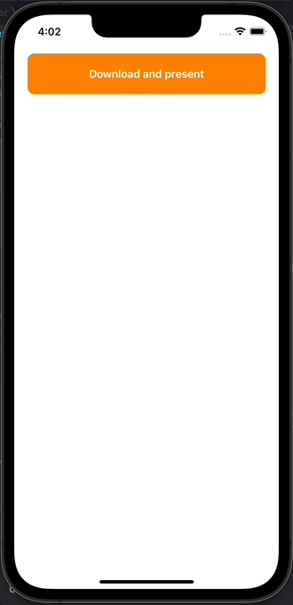

# CircularImageLoader
___
## Оглавление
- **[Описание](#Description)**
- **[Презентация](#Presentation)**

## Описание
Учебный проект. Анимированная загрузка и отображение "тяжелой" картинки

- Проект написан на **UIKit**
- Верстка интерфейса **Кодом**
- **Стек:**
- *CAShapeLayer*
- *CATransaction*
- *CABasicAnimation*
- *CAAnimationDelegate*
___

## Презентация
### Работа приложения

___

